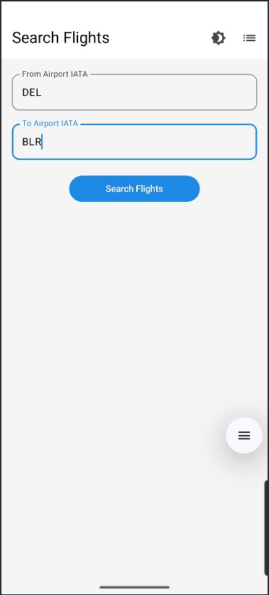

# 🛫 Flight Tracker App


## Introduction

Flight Tracker App is a modern Android application that enables users to search and track flights using airport codes and analyze 7-day flight history. It provides flight details like **terminal info**, **arrival/departure delays**, and **average journey durations** — all fetched from the AviationStack API.

Built using **Jetpack Compose**, the app offers a smooth, responsive, and polished user experience.

---

## Table of Contents
- [Problem Statement](#problem-statement)
- [Functionalities](#functionalities)
- [Features](#features)
- [Installation](#installation)
- [Usage](#usage)
- [Screenshots](#screenshots)
- [Architecture](#architecture)
- [Tech Stack](#tech-stack)
- [Upcoming Features](#upcoming-features)
- [Contributing](#contributing)
- [License](#license)

---

## Problem Statement

Accessing clean and relevant flight insights (like average delays and journey patterns) is not straightforward. Current solutions don’t allow:
- Tracking multiple flights together.
- Analyzing historical patterns over multiple days.
- Simple, persistent flight selection.

**Flight Tracker App** solves this by allowing:
- Flight tracking via airport code pairs.
- Selection of up to 3 active flights.
- Storage of daily flight stats and historical delay analysis.

---

## Functionalities

- 🔍 Search for flights between two airports using IATA codes.
-  Select up to **3 flights** for continuous tracking.
- 📊 Analyze:
  - Average journey time
  - Departure & arrival delays
  - Terminal and timing details
- 🗃️ Store daily flight records in Room Database.
- 🔁 Refresh flight data once daily.
- 🧹 Automatically clear records older than 7 days.
- 🌗 Supports Light/Dark Theme toggle.

---

## Features

###  Flight Search & Selection
- Input departure & arrival airport codes.
- Retrieve and display current flights using AviationStack API.
- Select up to 3 flights at a time (with clear selection feedback).
- Lazy-loaded scrollable flight cards.
- Invalid selection prompts and reset option.

###  Tracked Flight History (7 Days)
- Automatically logs daily data for selected flights.
- Computes:
  - Average journey duration
  - Average arrival and departure delay
- Displays structured flight info with clear UI layout.
- Auto-deletes data older than 7 days.

### 🎨 UI & UX Enhancements
- Clean Material 3 layout built in Jetpack Compose.
- Light and Dark theme toggle.
- Responsive input, feedback handling, and error states.
- Structured card-based views for flight display and analysis.

---

## Installation

```bash
git clone https://github.com/Prince22378/FlightTracker.git
cd FlightTracker
```
- Open the App in the Android Studio or Just install the app apk from this repo.


## Screenshots

To better understand the app flow and design, here are some sample screenshots:

| Feature | Screenshot |
|--------|------------|
| ✈️ Main Screen |  |
| ✈️ Flight Searching Screen|  |
| ✈️ Result Screen|  |
| ✈️ Flight Selection Screen|  |
| 📊 Tracked Flights |  |


## 📜 License

This project is for academic and educational purposes. You may modify and extend it under standard open-source guidelines.
